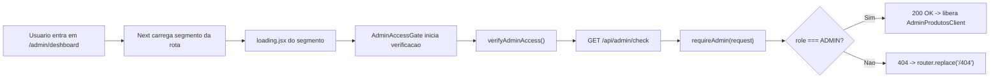

# Admin Dashboard (Branch Atual) - Guia Didatico Completo

## 1) Objetivo da branch

Esta branch implementa uma camada completa de **controle de acesso do painel admin** no App Router do Next.js, com foco em:

- restringir acesso de usuarios nao-admin;
- retornar **404 (pagina nao encontrada)** para nao-admin (em vez de mensagem de permissao);
- validar permissao **antes de renderizar o painel**;
- exibir um **loading customizado** durante a verificacao;
- manter fallback defensivo no client para erros 404 recebidos pelas APIs admin.

---

## 2) Problema resolvido (Antes vs Depois)

### Antes

- Usuario autenticado sem role `ADMIN` conseguia abrir a rota do painel.
- O painel carregava e mostrava erro textual de acesso restrito.
- Nao havia fluxo claro de verificacao inicial com experiencia de carregamento dedicada.

### Depois

- Usuario nao-admin recebe comportamento de **nao encontrado (404)**.
- A verificacao de permissao ocorre **antes** de liberar interface admin.
- Existe um `loading.jsx` da rota + loading interno do gate para feedback visual consistente.
- Se alguma chamada do painel retornar 404, o client redireciona para `/404`.

---

## 3) Mapa de arquitetura do fluxo de autorizacao



Resumo de responsabilidade:

- **Client**: iniciar verificacao e reagir ao status.
- **API check**: centralizar resposta da autorizacao.
- **Auth helper**: regra unica de admin.

---

## 4) Passo a passo, componente por componente

## 4.1 `src/lib/helpers/server/auth/adminAuth.js`

### O que faz

Centraliza autenticacao/autorizacao no backend:

- `getSessionUser(request)`: le token Bearer, valida usuario via Supabase e busca usuario no banco.
- `requireAdmin(request)`: usa `getSessionUser` e valida `role`.

### Regra importante desta branch

Quando o usuario **nao** e admin:

- retorna `Response.json(..., { status: 404 })` em vez de 403.
- objetivo: mascarar existencia do painel para quem nao deve acessar.

### Trecho-chave

```js
if (auth.user.role !== "ADMIN") {
    return {
        error: Response.json(
            { error: "Pagina nao encontrada" },
            { status: 404 },
        ),
    };
}
```

---

## 4.2 `src/app/api/admin/check/route.js`

### O que faz

Endpoint leve para **checar permissao admin** sem carregar dados de produtos.

### Fluxo

1. Recebe request com token.
2. Chama `requireAdmin(request)`.
3. Se erro, devolve o erro (inclusive 404 para nao-admin).
4. Se sucesso, responde `200` com dados basicos do usuario.

### Trecho-chave

```js
const auth = await requireAdmin(request);
if (auth.error) return auth.error;
return Response.json({ ok: true, user: { ... } }, { status: 200 });
```

---

## 4.3 `src/lib/helpers/api/adminProductsApi.js`

### O que faz

Client HTTP das rotas admin com token Supabase no header `Authorization`.

### Pontos implementados na branch

- `authFetch(url, init)`:
  - obtem token da sessao;
  - seta headers;
  - converte erro HTTP em `Error` com `error.status`.
- `verifyAdminAccess()`:
  - chama `/api/admin/check` para validação previa de acesso.

### Por que `error.status` e importante

Permite no client distinguir erros:

- `404` -> redirecionar para `/404`;
- outros erros -> exibir mensagem apropriada.

### Trecho-chave

```js
if (!res.ok) {
    const payload = await res.json().catch(() => ({}));
    const error = new Error(payload.error || `Erro HTTP ${res.status}`);
    error.status = res.status;
    throw error;
}
```

---

## 4.4 `src/app/(privado)/admin/deshboard/_components/AdminAccessGate.jsx`

### O que faz

Componente de gate (client-side) que bloqueia renderizacao do painel ate validar permissao.

### Fluxo interno

1. Estado inicial: `status = "checking"`.
2. `useEffect` chama `verifyAdminAccess()`.
3. Se sucesso: `status = "allowed"` e renderiza children.
4. Se erro: redireciona para `/404`.
5. Enquanto `checking`, renderiza loading customizado.

### Trecho-chave

```jsx
if (status !== "allowed") return <AdminCheckLoading />;
return children;
```

---

## 4.5 `src/app/(privado)/admin/deshboard/loading.jsx`

### O que faz

Loading oficial do segmento no App Router.

### Quando aparece

- durante carregamento inicial do segmento de rota;
- antes da tela ficar pronta para o usuario.

### Resultado

Experiencia visual mais suave e padrao do Next para transicoes/carregamentos da rota.

---

## 4.6 `src/app/(privado)/admin/deshboard/page.jsx`

### O que faz

Compoe a pagina admin aplicando gate + painel:

1. envolve `AdminProdutosClient` com `AdminAccessGate`;
2. garante que o painel so monte apos verificacao de permissao.

### Estrutura final

```jsx
<AdminAccessGate>
    <AdminProdutosClient />
</AdminAccessGate>
```

---

## 4.7 `src/app/(privado)/admin/deshboard/_components/AdminProdutosClient.jsx`

### Papel residual de fallback

Mesmo com o gate inicial, o componente mantem defesa:

- se alguma chamada de CRUD retornar `404`,
- ele executa `router.replace("/404")`.

Isso cobre casos como:

- expiracao de sessao entre a verificacao e uma acao de tela;
- role alterada no meio da sessao;
- resposta inconsistente de backend por autorizacao.

---

## 5) Fluxo completo de execucao (sequencia temporal)

1. Usuario entra em `/admin/deshboard`.
2. Next inicia carga do segmento e pode exibir `loading.jsx`.
3. `page.jsx` monta `AdminAccessGate`.
4. Gate chama `verifyAdminAccess()`.
5. API `/api/admin/check` chama `requireAdmin`.
6. Backend valida token + usuario + role:
   - se role `ADMIN`: `200`.
   - se role diferente: `404`.
7. No client:
   - `200` -> gate libera `AdminProdutosClient`;
   - `404` -> redireciona para `/404`.
8. Dentro do painel, erros 404 em chamadas futuras tambem redirecionam para `/404`.

---

## 6) Por que usar `loading.jsx` + gate ao mesmo tempo

Nao sao redundantes; atuam em camadas diferentes:

- `loading.jsx` (Next App Router): loading do **segmento de rota**.
- `AdminAccessGate`: loading da **checagem de autorizacao** do client.

Beneficio prático:

- transicao inicial da rota fica fluida;
- validacao de permissao tem feedback proprio e claro.

---

## 7) Cenarios de usuario

## 7.1 Admin autenticado

- Token valido.
- `requireAdmin` aprova.
- `/api/admin/check` retorna 200.
- Gate libera painel admin.

## 7.2 Usuario autenticado nao-admin

- Token valido.
- `requireAdmin` identifica role diferente de `ADMIN`.
- Retorno 404.
- Gate redireciona para `/404`.

## 7.3 Sessao expirada / sem token

- `authFetch` falha por ausencia de token (401 local no client helper) ou API retorna erro de autenticacao.
- O gate nao libera painel.
- O fallback de navegacao impede acesso funcional ao admin.

---

## 8) Erros comuns e como diagnosticar

## 8.1 "Cai em 404 mesmo com usuario correto"

Checklist:

1. confirmar `role` do usuario na tabela `User` (`ADMIN`);
2. garantir que `/api/syncUser` esta atualizando role no login;
3. confirmar token valido na sessao Supabase;
4. testar `/api/admin/check` e checar status real da resposta.

## 8.2 "Painel abre e depois redireciona para 404"

Possiveis causas:

- token expirou apos carregamento;
- chamada de CRUD retornou 404 por perda de permissao;
- role alterada no banco durante sessao ativa.

## 8.3 "Erro de autenticacao nas APIs admin"

Verificar:

- header `Authorization: Bearer <token>`;
- sessao ativa em `supabase.auth.getSession()`;
- consistencia de ambiente (`NEXT_PUBLIC_SUPABASE_URL`, key publica).

---

## 9) Quadro de responsabilidades por arquivo

| Arquivo | Camada | Responsabilidade principal | Entrada | Saida |
|---|---|---|---|---|
| `adminAuth.js` | Backend | Validar usuario e role admin | Request com token | `200` logico (auth) ou erro (`401/403/404`) |
| `api/admin/check/route.js` | Backend API | Endpoint de check rapido | Request | JSON `{ ok: true, user }` ou erro |
| `adminProductsApi.js` | Frontend API client | Chamada autenticada e parse de erro com `status` | URL + init | JSON ou `Error` com `status` |
| `AdminAccessGate.jsx` | Frontend UI/fluxo | Guard de acesso + loading de verificacao | children | renderiza painel ou redireciona `/404` |
| `loading.jsx` | App Router UI | Loading do segmento da rota | n/a | estado visual de carregamento |
| `page.jsx` | Composicao de pagina | Envelopar painel com gate | n/a | tela protegida |
| `AdminProdutosClient.jsx` | Frontend tela admin | CRUD e fallback defensivo para 404 | interacoes do usuario | atualiza tela ou redireciona `/404` |

---

## 10) Trechos de codigo mais importantes (resumo)

## 10.1 Bloqueio no backend por role

```js
if (auth.user.role !== "ADMIN") {
    return { error: Response.json({ error: "Pagina nao encontrada" }, { status: 404 }) };
}
```

## 10.2 Check de acesso no client

```js
export function verifyAdminAccess() {
    return authFetch("/api/admin/check");
}
```

## 10.3 Redirecionamento para 404 no gate

```jsx
try {
    await verifyAdminAccess();
    setStatus("allowed");
} catch {
    router.replace("/404");
}
```

---

## 11) Checklist de validacao manual

1. Logar com usuario `ADMIN` e abrir `/admin/deshboard`.
2. Confirmar que o loading aparece durante verificacao.
3. Confirmar que o painel abre normalmente para admin.
4. Logar com usuario nao-admin e abrir `/admin/deshboard`.
5. Confirmar redirecionamento para `/404`.
6. Com admin logado, disparar acao de produto e validar que continua funcional.
7. Simular sessao expirada (logout / token invalido) e confirmar bloqueio de acesso.

---

## 12) Conclusao

Esta branch evoluiu o painel admin de um modelo "abre e depois nega" para um fluxo mais seguro e limpo: **valida primeiro, renderiza depois**.  
Com isso, o sistema fica mais coerente em seguranca, UX e manutencao, seguindo boas praticas do Next App Router para rotas protegidas.

