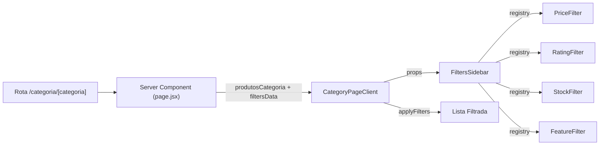

# Filtros Reutilizáveis e Dinâmicos por Categoria

Esta documentação descreve **o que foi implementado** para permitir filtros reutilizáveis por página e filtros dinâmicos baseados na categoria atual. O foco é:

- cada página escolher **quais filtros** aparecem e **em qual ordem**;
- a página de categoria **derivar opções e limites** a partir dos produtos da própria categoria;
- manter compatibilidade com o fluxo atual de filtros e ordenação.

> **Sobre animações gráficas**  
> Este documento inclui:
> - Diagramas Mermaid (para visão estrutural).
> - Um bloco HTML/CSS com animação (para renderizadores que suportem HTML em Markdown).

---

## Visão Geral das Mudanças

### 1) Filtros reutilizáveis por página
O `FiltersSidebar` agora aceita:
- `enabled`: lista de chaves de filtros e sua ordem
- `data`: dados variáveis (categorias, features, limites)

Se `enabled` ou `data` não forem passados, o comportamento padrão é mantido.

### 2) Página de categoria com filtros dinâmicos
A página `/categoria/[categoria]` foi separada em:
- **Server Component**: resolve categoria, monta lista da categoria e gera `filtersData`.
- **Client Component**: mantém estado de filtros e aplica `applyFilters`.

Com isso:
- a lista é limitada à categoria da rota;
- os filtros mostram **apenas valores relevantes** para aquela categoria;
- ao mudar de categoria (nav), os filtros **resetam automaticamente** porque o client component remonta.

---

## Arquivos Alterados/Adicionados

**Novos**
- `src/app/categoria/[categoria]/CategoryPageClient.jsx`

**Atualizados**
- `src/app/categoria/[categoria]/page.jsx`
- `src/components/components-loja/filtro/FiltersSidebar.jsx`
- `src/components/components-loja/filtro/CategoryFilter.jsx`
- `src/components/components-loja/filtro/FeatureFilter.jsx`
- `src/components/components-loja/filtro/PriceFilter.jsx`

---

## API dos Filtros (Atualizada)

### `FiltersSidebar`

**Props**
- `filters` (obrigatório): estado dos filtros
- `setFilters` (obrigatório): setter do estado
- `enabled?: string[]` (opcional): chaves dos filtros e ordem
- `data?: object` (opcional): dados variáveis
- `className?: string` (opcional): classes extras

**Chaves válidas**
- `category`
- `price`
- `rating`
- `stock`
- `features`

**Fallback**
Se `enabled` não for informado, ele renderiza todos os filtros na ordem padrão.

---

### `CategoryFilter`
**Props novas**
- `categories?: Array<{ id: number, title: string, value: string }>`

**Fallback**
Se `categories` não for passado, usa as categorias internas.

---

### `FeatureFilter`
**Props novas**
- `features?: string[]`

**Fallback**
Se `features` não for passado, usa o array padrão interno.

---

### `PriceFilter`
**Props novas**
- `minPlaceholder?: string` (default `"Min"`)
- `maxPlaceholder?: string` (default `"Max"`)
- `minLimit?: number`
- `maxLimit?: number`

**Comportamento**
Os limites (`minLimit`, `maxLimit`) restringem o valor que o usuário pode aplicar.

---

## Página `/categoria/[categoria]` (Server + Client)

### Server Component (`page.jsx`)
Responsável por:
1. Ler o slug da rota.
2. Normalizar e mapear com `categorySlugMap`.
3. Montar a lista da categoria.
4. Gerar `filtersData` com base nos produtos da categoria:
   - `features`: únicas presentes nos produtos.
   - `minLimit/maxLimit`: calculados pelo menor/maior `priceCents`.

### Client Component (`CategoryPageClient.jsx`)
Responsável por:
1. Manter `filters` via `useState`.
2. Aplicar `applyFilters` na lista da categoria.
3. Renderizar `FiltersSidebar` com:
   - `enabled = ["price", "rating", "stock", "features"]`
   - `data = filtersData`

---

## Como os Dados Dinâmicos são Calculados

### Features
```js
const features = [
  ...new Set(produtosCategoria.flatMap(p => p.features || [])),
];
```

### Limites de preço
```js
const priceCentsList = produtosCategoria.map(p => p.priceCents ?? 0);
const minLimit = Math.floor(Math.min(...priceCentsList) / 100);
const maxLimit = Math.ceil(Math.max(...priceCentsList) / 100);
```

O filtro de preço continua trabalhando com cents internamente, mas o usuário digita valores em unidade.

---

## Exemplo de Uso por Página

### Loja (todos os filtros)
```jsx
<FiltersSidebar
  filters={filters}
  setFilters={setFilters}
  enabled={["category", "price", "rating", "stock", "features"]}
  data={{}}
/>
```

### Categoria (filtros de refinamento)
```jsx
<FiltersSidebar
  filters={filters}
  setFilters={setFilters}
  enabled={["price", "rating", "stock", "features"]}
  data={filtersData}
/>
```

---

## Diagrama (Arquitetura)



---

## Animação Gráfica (Opcional)

> Requer suporte a HTML/CSS no renderizador Markdown.

<style>
.filters-doc-flow {
  display: grid;
  grid-template-columns: repeat(3, minmax(140px, 1fr));
  gap: 12px;
  align-items: center;
  margin: 16px 0;
}
.filters-doc-box {
  padding: 12px 14px;
  border: 1px solid #ddd;
  border-radius: 10px;
  background: #fafafa;
  font-family: ui-sans-serif, system-ui;
  font-size: 12px;
  text-align: center;
}
.filters-doc-arrow {
  height: 4px;
  background: linear-gradient(90deg, #ddd, #9dd6ff, #ddd);
  border-radius: 6px;
  position: relative;
  overflow: hidden;
}
.filters-doc-arrow::after {
  content: "";
  position: absolute;
  inset: 0;
  background: linear-gradient(90deg, transparent, #4aa3ff, transparent);
  transform: translateX(-100%);
  animation: flow 2s infinite linear;
}
@keyframes flow {
  from { transform: translateX(-100%); }
  to   { transform: translateX(100%); }
}
</style>

<div class="filters-doc-flow">
  <div class="filters-doc-box">Server (page.jsx)</div>
  <div class="filters-doc-arrow"></div>
  <div class="filters-doc-box">CategoryPageClient</div>
  <div class="filters-doc-box">FiltersSidebar</div>
  <div class="filters-doc-arrow"></div>
  <div class="filters-doc-box">applyFilters()</div>
  <div class="filters-doc-box">Lista Filtrada</div>
  <div class="filters-doc-arrow"></div>
  <div class="filters-doc-box">UI Final</div>
</div>

---

## Compatibilidade e Migração

- Compatível com páginas antigas: `enabled`/`data` são opcionais.
- `applyFilters` permanece intacto.
- O comportamento do filtro na página `/loja` continua igual.

---

## Checklist de QA

- A rota `/categoria/[categoria]` mostra apenas itens da categoria.
- Os filtros exibem valores válidos apenas daquela categoria.
- A troca de categoria no nav redefine os filtros.
- `FiltersSidebar` em outras páginas ainda funciona como antes.

---

## Referência Rápida

**Server Component**
- `src/app/categoria/[categoria]/page.jsx`

**Client Component**
- `src/app/categoria/[categoria]/CategoryPageClient.jsx`

**Filters**
- `src/components/components-loja/filtro/FiltersSidebar.jsx`
- `src/components/components-loja/filtro/PriceFilter.jsx`
- `src/components/components-loja/filtro/RatingFilter.jsx`
- `src/components/components-loja/filtro/StockFilter.jsx`
- `src/components/components-loja/filtro/FeatureFilter.jsx`
