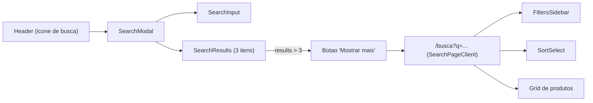

# Search (Modal + /busca)

Esta documentacao descreve o sistema de busca implementado nesta branch, cobrindo:

- Modal de busca no header com resultados imediatos.
- Botao "Mostrar mais" que redireciona para a pagina `/busca`.
- Pagina `/busca` com layout de categoria e filtros.
- Debounce e sincronizacao de URL.
- Pontos de manutencao e troubleshooting.

> **Sobre animacoes graficas**  
> Este documento inclui:
> - Diagramas Mermaid (visao estrutural).
> - Um bloco HTML/CSS com animacao (para renderizadores que suportem HTML em Markdown).

---

## Visao Geral

O fluxo foi desenhado em 3 niveis:

1. **Modal**: mostra ate 3 produtos, mesmo antes do usuario digitar.
2. **Mostrar mais**: aparece apenas quando a busca retorna mais de 3 produtos.
3. **Pagina /busca**: exibe os resultados completos com o mesmo layout e filtros das paginas de categoria.

O objetivo e acelerar a descoberta de produtos e permitir refinamento com filtros na pagina dedicada.

---

## Fluxo do Usuario

1. Usuario clica no icone de busca no header.
2. Modal abre com 3 produtos iniciais (sugestoes).
3. Usuario digita e a lista do modal filtra os produtos.
4. Se houver mais de 3 resultados, o botao **Mostrar mais** aparece.
5. Ao clicar em **Mostrar mais**:
   - O modal fecha.
   - O usuario e redirecionado para `/busca?q=termo`.
6. Na pagina `/busca`, a lista pode ser refinada com filtros e ordenacao.

---

## Diagrama de Arquitetura



---

## Animacao Grafica (Opcional)

> Requer suporte a HTML/CSS no renderizador Markdown.

<style>
.search-doc-flow {
  display: grid;
  grid-template-columns: repeat(4, minmax(140px, 1fr));
  gap: 12px;
  align-items: center;
  margin: 16px 0;
}
.search-doc-box {
  padding: 12px 14px;
  border: 1px solid #ddd;
  border-radius: 10px;
  background: #fafafa;
  font-family: ui-sans-serif, system-ui;
  font-size: 12px;
  text-align: center;
}
.search-doc-arrow {
  height: 4px;
  background: linear-gradient(90deg, #ddd, #9dd6ff, #ddd);
  border-radius: 6px;
  position: relative;
  overflow: hidden;
}
.search-doc-arrow::after {
  content: "";
  position: absolute;
  inset: 0;
  background: linear-gradient(90deg, transparent, #4aa3ff, transparent);
  transform: translateX(-100%);
  animation: flow 2s infinite linear;
}
@keyframes flow {
  from { transform: translateX(-100%); }
  to   { transform: translateX(100%); }
}
</style>

<div class="search-doc-flow">
  <div class="search-doc-box">Header</div>
  <div class="search-doc-arrow"></div>
  <div class="search-doc-box">SearchModal</div>
  <div class="search-doc-arrow"></div>
  <div class="search-doc-box">SearchResults</div>
  <div class="search-doc-arrow"></div>
  <div class="search-doc-box">/busca</div>
</div>

---

## Arquivos e Responsabilidades

**Entrada do usuario (Header)**
- `src/components/layout/Header.jsx`
  - Abre o `SearchModal`.

**Modal e campo de busca**
- `src/components/Search/SearchModal.jsx`
  - Mantem o estado de busca local (`search`).
  - Mostra 3 produtos iniciais quando a busca esta vazia.
  - Filtra lista de produtos conforme o usuario digita.
- `src/components/Search/SearchInput.jsx`
  - Input reutilizavel (`type="search"`), usado no modal e na pagina `/busca`.

**Resultados do modal**
- `src/components/Search/SearchResults.jsx`
  - Exibe apenas 3 itens.
  - Mostra botao "Mostrar mais" apenas quando `results > 3` e `query` nao esta vazia.
  - Ao clicar, fecha modal e navega para `/busca?q=...`.

**Pagina de resultados**
- `src/app/busca/page.jsx`
  - Server Component.
  - Gera `filtersData` (features e limites) usando a base completa.
  - Envia `initialQuery` para o client.
- `src/app/busca/SearchPageClient.jsx`
  - Client Component.
  - Aplica `applyFilters` + `applySort`.
  - Sincroniza `?q=` com debounce.
  - Renderiza filtros e grid, seguindo o layout das categorias.

**Debounce**
- `src/lib/useDebouncedValue.js`
  - Retarda a atualizacao de `?q=` para evitar renderes excessivos.

**Fechar modal ao clicar no produto**
- `src/components/components-loja/ProductCard.jsx`
  - Agora aceita prop `onClick`, usada para fechar o modal antes da navegacao.

---

## Como o Search Funciona

### Modal
- Se o usuario nao digitou nada:
  - Mostra 3 produtos iniciais da base.
  - O botao "Mostrar mais" nao aparece.
- Se o usuario digitou:
  - Filtra pelo nome do produto.
  - Exibe no maximo 3 itens.
  - Exibe "Mostrar mais" se houver mais de 3 resultados.

### Pagina /busca
- Usa o mesmo layout e filtros das paginas de categoria.
- O termo de busca vem de `?q=` na URL.
- A barra de busca no topo:
  - Atualiza resultados.
  - Atualiza a URL com debounce (300ms).

---

## Como Usar (Dev)

### Abrir o modal a partir do Header
```jsx
import SearchModal from "@/components/Search/SearchModal";

{openSearch && <SearchModal onClose={() => setOpenSearch(false)} />}
```

### Redirecionar para pagina de busca
```jsx
router.push(`/busca?q=${encodeURIComponent(query)}`);
```

### Barra de busca na pagina /busca
```jsx
<SearchInput
  value={filters.search}
  onChange={(value) => setFilters((prev) => ({ ...prev, search: value }))}
  placeholder="Buscar produtos..."
/>
```

---

## Onde Ajustar Caso Algo De Errado

**1. Modal nao abre**
- Verifique o `Header`:
  - `src/components/layout/Header.jsx`

**2. Resultados do modal nao aparecem**
- Verifique o filtro e a lista no modal:
  - `src/components/Search/SearchModal.jsx`
- Verifique a renderizacao:
  - `src/components/Search/SearchResults.jsx`

**3. Botao "Mostrar mais" nao aparece**
- Condicao do botao:
  - `hasMore` em `src/components/Search/SearchResults.jsx`

**4. /busca nao carrega**
- Verifique a rota:
  - `src/app/busca/page.jsx`

**5. URL nao atualiza ao digitar**
- Verifique debounce e `router.replace`:
  - `src/app/busca/SearchPageClient.jsx`
  - `src/lib/useDebouncedValue.js`

**6. Modal nao fecha ao clicar no produto**
- Verifique o `ProductCard`:
  - `src/components/components-loja/ProductCard.jsx`

---

## Checklist de QA

1. Abrir modal e ver 3 produtos antes de digitar.
2. Digitar termo e confirmar que a lista do modal filtra.
3. Verificar se o botao "Mostrar mais" aparece apenas com `results > 3`.
4. Clicar em "Mostrar mais" e confirmar redirecionamento para `/busca?q=...`.
5. Na pagina `/busca`, testar filtros e ordenacao.
6. Confirmar que a URL atualiza com debounce ao digitar.

---

## Observacoes Tecnicas

- O estado do input na pagina `/busca` inicia com `initialQuery` vindo do server.
- A sincronizacao por `back/forward` nao atualiza o input automaticamente (decisao intencional para evitar warning de setState em effect).
